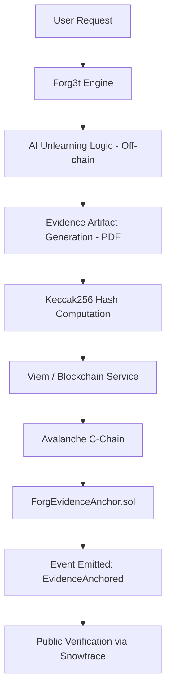

# Forg3t Protocol — AI Unlearning on Avalanche


Forg3t is the world's first protocol dedicated to **Verifiable AI Unlearning**. It enables organizations and individuals to selectively remove data from AI models and anchor the cryptographic evidence of this removal directly onto the Avalanche blockchain, ensuring transparency, compliance, and trust without compromising model performance.

**🚀 [Try the Live Demo](http://buildgames.forg3t.io/)**

---

## 🛡️ Why AI Unlearning?

As AI models become more pervasive, the ability to **"forget"** becomes as important as the ability to learn.

1.  **Privacy as a Right**: With global regulations like GDPR and the EU AI Act, individuals have the "Right to be Forgotten." Forg3t provides the infrastructure to execute this at the model level.
2.  **Model Integrity**: Removing biased, outdated, or toxic data is critical for maintaining high-quality AI outputs.
3.  **Copyright Compliance**: Enables the removal of copyrighted material from training sets with immutable proof for legal verification.

## 🔺 Why Avalanche?

Forg3t uses the **Avalanche C-Chain** as its primary trust layer for several critical reasons:

-   **Sub-second Finality**: When a user requests unlearning, they receive immediate confirmation that their evidence is anchored.
-   **Ultra-Low Cost**: Optimized smart contracts on Avalanche allow for high-frequency evidence anchoring at a fraction of the cost of other L1s.
-   **Reliability**: Avalanche's high uptime and decentralized nature provide the perfect environment for long-term storage of unlearning proofs.
-   **Advanced Customization**: Future-proof architecture designed to leverage Avalanche Subnets for enterprise-specific privacy requirements.

---

## 🏗️ Technical Architecture

Forg3t combines high-performance off-chain AI processing with secure on-chain anchoring.



### Core Components
-   **Frontend**: React & Vite with a premium, responsive UI.
-   **Smart Contract**: `ForgEvidenceAnchor.sol` — A high-efficiency Solidity contract for indexing unlearning jobs.
-   **Blockchain Layer**: Viem-based interface for interacting with the Avalanche C-Chain.
-   **Database**: Supabase for managing user sessions and request history.

---

## 📜 Smart Contract Information

The protocol's heartbeat is the **ForgEvidenceAnchor** contract, deployed on the Avalanche Mainnet.

-   **Contract Address**: `0x20E772a60CEE7D8E6706E698B129FD917c3936bf`
-   **Network**: Avalanche C-Chain
-   **Explorer**: [Snowtrace Explorer](https://avascan.info/blockchain/c/address/0x20E772a60CEE7D8E6706E698B129FD917c3936bf)

---

## 🚀 Getting Started

### Prerequisites
-   Node.js (v18+)
-   NPM or Yarn
-   An Avalanche wallet (Core, MetaMask) with a small amount of AVAX for gas.

### Installation
1. Clone the repository:
   ```bash
   git clone https://github.com/Alvinagile/Forg3t-Avax.git
   cd Forg3t-Avax
   ```
2. Install dependencies:
   ```bash
   npm install
   ```
3. Set up environment variables:
   Create a `.env` file in the root:
   ```env
   VITE_SUPABASE_URL=your_supabase_url
   VITE_SUPABASE_ANON_KEY=your_supabase_key
   VITE_ANCHOR_CONTRACT_ADDRESS=0x20E772a60CEE7D8E6706E698B129FD917c3936bf
   ```

### Execution
Run the development server:
```bash
npm run dev
```

### Build
Build for production:
```bash
npm run build
```

---

## ⚖️ License

Built on Avalanche. Forg3t Protocol © 2026.
