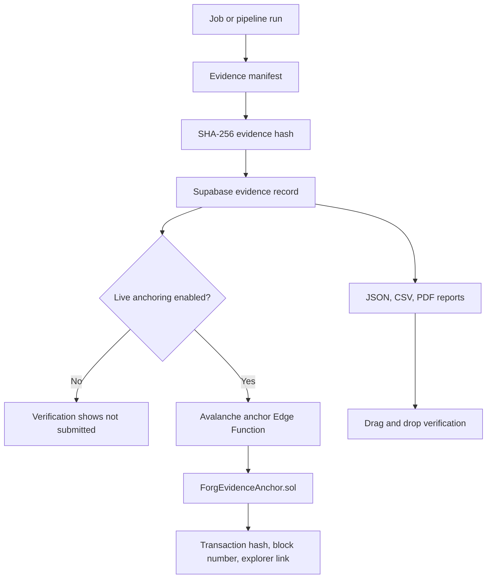

# Forg3t Protocol - AI Unlearning Evidence on Avalanche


Forg3t is a control plane for verifiable AI unlearning and suppression workflows. It creates sanitized evidence bundles, computes deterministic commitments, optionally anchors those commitments on Avalanche, and gives auditors a public verification flow without exposing raw customer data.

This repository is scoped to product and code readiness. It does not claim enterprise pilot completion, customer attestation, recorded demo completion, or production deployment unless those artifacts are separately provided and verified.

## Why Avalanche

Avalanche C-Chain is used as the trust layer for evidence commitments:

- Low-cost commitment anchoring for repeated evidence records.
- Public transaction and block metadata for reviewers and auditors.
- EVM compatibility through the existing `ForgEvidenceAnchor.sol` contract and Viem-based backend calls.
- Future room for project-specific or enterprise-specific infrastructure.

## Architecture



## Core Components

- Frontend: React, Vite, TypeScript.
- Backend: Supabase Edge Functions for jobs, evidence, reports, verification, integrations, anchors, and pipelines.
- Database: Supabase Postgres migrations for multi-project data, RBAC, evidence records, anchors, exports, and pipelines.
- Blockchain: `contracts/contracts/ForgEvidenceAnchor.sol` and Viem helpers for Avalanche Fuji or C-Chain.
- SDK/API surface: curl examples and OpenAI-compatible or generic HTTP integration flows documented under `docs`.

## Getting Started

```bash
npm install
npm run dev
```

Required local frontend environment:

```env
VITE_SUPABASE_URL=...
VITE_SUPABASE_ANON_KEY=...
VITE_AVALANCHE_DEFAULT_NETWORK=fuji
```

Backend and anchoring configuration is documented in:

- `.env.example`
- `supabase/.env.example`
- `docs/api/evidenceAnchoring.md`
- `docs/architecture/evidenceAnchoring.md`

## Phase 2 Evidence Readiness

Run local code checks:

```bash
npm test
npm run lint
npm run build
```

Run the code-side Phase 2 smoke after configuring Supabase auth:

```bash
SUPABASE_URL=... \
SUPABASE_ANON_KEY=... \
SUPABASE_ACCESS_TOKEN=... \
PROJECT_ID=... \
npm run smoke:phase2
```

To submit a real Avalanche transaction, add `PHASE2_ANCHOR=true AVALANCHE_NETWORK=fuji`. Only do this when the Edge Function has a funded anchor wallet and a deployed contract address. The smoke script prints job id, evidence id, hashes, verification result, export ids, and live transaction fields when anchoring is enabled.

For the production reviewer automation flow, use:

```bash
npm run automation:reviewer-anchor
```

This command signs in with `FORG3T_AUTOMATION_EMAIL` and `FORG3T_AUTOMATION_PASSWORD`, creates a completed job and evidence record, submits the evidence to the Avalanche anchor Edge Function, verifies the result, and creates JSON/CSV/PDF exports. Keep reviewer and automation credentials in a secure runtime environment only.

Full reviewer commands, routes, expected outputs, screenshots to capture, and blocked non-code items are in `docs/phase2-readiness.md`.

## License

Built on Avalanche. Forg3t Protocol (c) 2026.
