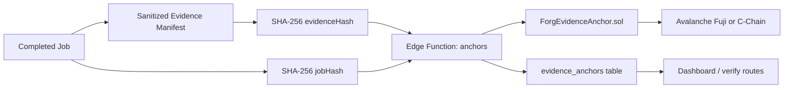

# Evidence Anchoring Architecture

## Purpose

Forg3t turns a completed unlearning or suppression job into a sanitized evidence bundle, computes a deterministic SHA-256 commitment, stores the full operational metadata off-chain, and anchors only non-sensitive commitments on Avalanche.

This repo intentionally excludes enterprise pilot management work. The scope here is the software control plane needed to create jobs, generate evidence, anchor commitments, export reports, and verify results.

## Control Plane

- React dashboard in `project/src`
- Supabase Postgres for multi-project data, RBAC, evidence, anchors, pipelines, integrations, and exports
- Supabase Edge Functions for privileged backend actions
- Existing `ForgEvidenceAnchor.sol` contract for immutable Avalanche commitments

## Job Lifecycle

1. A developer, admin, or owner creates a job from the dashboard or through the jobs API.
2. The job is stored in `unlearning_requests`, which acts as the primary job record.
3. A matching `evidence_records` row is created for the job.
4. If the job is already completed, the backend generates a sanitized evidence manifest and computes:
   - `jobHash`
   - `evidenceHash`
   - `bundleHash`
5. Reports and public verification tokens are derived from the same evidence record.

## Evidence Bundle Lifecycle

The canonical evidence artifact is a JSON manifest with:

- `schemaVersion`
- `evidenceId`
- `jobId`
- `projectId`
- `projectName`
- `generatedAt`
- `targetType`
- `executionLane`
- `requestReasonSummary`
- `targetScopeSummary`
- `validationSummary`
- `integration` summary
- privacy notes describing what is and is not anchored

The bundle intentionally excludes:

- raw customer data
- raw prompts
- sensitive target text
- model outputs
- API keys or secrets

## Avalanche Anchoring Flow

### What gets stored on-chain

- `jobHash` as `bytes32`
- `evidenceHash` as `bytes32`

### What gets stored off-chain

- project membership and RBAC
- evidence manifest JSON
- report payloads
- transaction hash
- contract address
- chain id
- block number
- confirmation timestamps
- reporting exports

### What is never stored on-chain

- raw customer data
- private prompts
- private targets
- model outputs
- evidence contents beyond the commitment
- report body text

## Verification Flow

Verification supports:

- authenticated dashboard verification
- scoped public verification via `public_verification_token`
- drag-and-drop verification of JSON bundles and PDF reports

The upload flow computes the local SHA-256 hash in the browser, then sends only verification-safe metadata to the backend:

- artifact type
- local hash
- optional `evidenceId`
- optional scoped public token
- optional transaction metadata if present

The backend returns:

- hash match / mismatch
- anchor found / pending / confirmed
- explorer URL
- minimal public metadata only when the caller is unauthenticated

## Role-Based Access

Supported roles:

- `owner`
- `admin`
- `compliance`
- `auditor`
- `developer`
- `viewer`

Role intent:

- Developers create jobs and inspect technical state.
- Compliance users review evidence and export reports.
- Auditors verify evidence with read-only access.
- Admins and owners manage project settings and memberships.

## API-Based Integrations

Integrations are stored per project and can target:

- OpenAI-compatible endpoints
- generic HTTP endpoints

Secrets are stored separately in `integration_secrets` using AES-GCM encryption derived from `FORG3T_SECRET_ENCRYPTION_KEY`. Secrets never return to the frontend.

## Security Assumptions

- Supabase service role credentials are available only to Edge Functions.
- Avalanche anchoring uses a server-side private key via environment variables.
- Public verification is limited to scoped tokens or uploaded artifact hashes, not tenant-wide queries.
- Evidence manifests must remain sanitized; operators should avoid copying raw target content into free-text fields.
