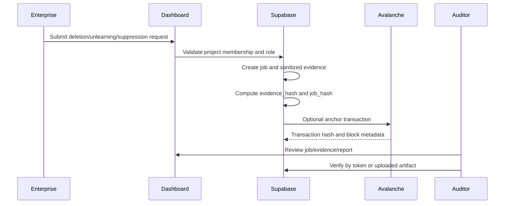

# Compliance Workflow

This document explains the Forg3t workflow for legal, audit, procurement, and technical reviewers.

The workflow description is evidence of the implemented process, not proof that an enterprise has adopted or approved the process.

## Audience

- Legal teams evaluating evidence and non-claims.
- Audit teams evaluating repeatability and verification.
- Procurement teams evaluating operational controls.
- Technical reviewers evaluating implementation and data flow.

## Workflow Summary

## 1. Deletion or Unlearning Request

A project member starts a request from the dashboard or API. In this repository, the request is represented by an `unlearning_requests` row.

Relevant evidence:

- UI: `src/pages/Unlearning.tsx`
- API: `POST /functions/v1/jobs`
- Database: `unlearning_requests`
- Docs: `docs/api/evidenceAnchoring.md`

Enterprise framing:

- The request records the target type, execution lane, target scope summary, validation metrics, and status.
- The request should avoid raw customer content in reviewer-facing evidence.
- A real customer deletion request or pilot request is external evidence and must be supplied separately if claimed.

## 2. Project and Role Validation

Before sensitive operations, the backend verifies project membership and allowed roles.

Relevant evidence:

- Shared RBAC: `supabase/functions/_shared/rbac.ts`
- Project access function: `supabase/functions/project-access/index.ts`
- Migration policies: `supabase/migrations/20260430170000_avalanche_build_games.sql`
- RLS fix: `supabase/migrations/20260524153640_fix_project_memberships_rls.sql`
- Frontend role helpers: `src/lib/domainUtils.ts`

Enterprise framing:

- Access is project-scoped.
- Roles include owner, admin, compliance, auditor, developer, and viewer.
- Role behavior is implemented in frontend affordances, Edge Function checks, and database RLS.

## 3. Job Creation

The job function creates or updates the operational job record and can create a corresponding evidence record.

Relevant evidence:

- `supabase/functions/jobs/index.ts`
- `src/lib/api.ts`
- `scripts/phase2-smoke.mjs`

Enterprise framing:

- A completed job can represent a suppression validation run or a manual/API endpoint validation result.
- The job records validation score, total tests, passed tests, failed tests, leak score, and processing metadata when available.

## 4. Validation or Suppression Run

Forg3t supports black-box suppression verification for API-accessible AI systems. This means the system tests externally observable behavior and records evidence. It does not claim internal model-weight deletion unless the integration provides verifiable internal evidence.

Relevant evidence:

- Integration UI: `src/pages/Settings.tsx`
- Integration API: `supabase/functions/integrations/index.ts`
- Assistant suppression helper: `supabase/functions/_shared/assistantSuppression.ts`
- API lifecycle docs: `docs/api/evidenceAnchoring.md`

Enterprise framing:

- Black-box suppression is appropriate when the organization can observe and test API behavior but cannot inspect model internals.
- White-box deletion claims require separate, integration-specific proof.

## 5. Evidence Generation

Evidence is stored as a sanitized bundle and report payload. The system computes deterministic hashes for later verification.

Relevant evidence:

- Evidence generation: `supabase/functions/jobs/index.ts`, `supabase/functions/pipelines/index.ts`
- Workflow helpers: `shared/workflows.ts`
- Evidence table: `evidence_records`

Enterprise framing:

- Evidence is intended to be reviewable without exposing raw customer data.
- The evidence hash is the cryptographic commitment to the sanitized bundle.
- The job hash is the cryptographic commitment to the job-level evidence.

## 6. Avalanche Anchoring

If configured, Forg3t anchors evidence commitments on Avalanche.

Relevant evidence:

- Contract: `contracts/contracts/ForgEvidenceAnchor.sol`
- Anchor function: `supabase/functions/anchors/index.ts`
- Viem helper: `supabase/functions/_shared/avalanche.ts`
- Anchor table: `evidence_anchors`

Enterprise framing:

- Avalanche provides public transaction and block metadata.
- The application stores transaction hash, network, chain id, block number, explorer URL, contract address, and anchor status.
- Do not claim a live transaction unless it was actually submitted by the configured environment.

## 7. Auditor Verification

Auditors can verify evidence through authenticated or public flows.

Relevant evidence:

- UI: `src/pages/Verify.tsx`
- Public route: `/verify/<public_verification_token>`
- Backend: `supabase/functions/verify-evidence/index.ts`

Enterprise framing:

- Auditors can verify by public token without broad workspace access.
- Uploaded JSON/PDF verification compares local hash to stored expected hash where possible.
- Verification statuses distinguish mismatch, pending anchor, confirmed anchor, failed anchor, and missing anchor.

## 8. Report Export

Reports can be exported in JSON, CSV, and PDF formats.

Relevant evidence:

- Backend: `supabase/functions/reports/index.ts`
- PDF generator: `src/lib/pdfGenerator.ts`
- UI: `src/pages/JobDetail.tsx`, `src/pages/EvidenceDetail.tsx`
- Table: `report_exports`

Enterprise framing:

- JSON supports machine review.
- CSV supports spreadsheet and procurement workflows.
- PDF supports legal/audit packet review.
- A generated report is a technical artifact, not a legal conclusion by itself.

## 9. Public Verification Link

Each evidence record can include a public verification token.

Relevant evidence:

- `evidence_records.public_verification_token`
- `src/pages/Verify.tsx`
- `supabase/functions/verify-evidence/index.ts`

Enterprise framing:

- Public verification should expose scoped proof, not raw internal project data.
- Reviewers can capture a public verification screenshot as grant evidence.

## 10. Admin Review

Admins and owners can manage project settings, integrations, and memberships.

Relevant evidence:

- `src/pages/Settings.tsx`
- `supabase/functions/project-access/index.ts`
- `supabase/functions/integrations/index.ts`

Enterprise framing:

- Admins prepare integrations and review access.
- Compliance and auditor roles support separation of duties for review workflows.

## Founder Evidence Required

The founder must provide or capture:

- Enterprise pilot approval, if claimed.
- Customer or partner attestation, if claimed.
- Real customer usage evidence, if claimed.
- Screenshots from the actual review environment.
- Demo video, if requested by the grant manager.
- Live Avalanche explorer proof for any transaction included in the final submission.

## Non-Claims

This workflow does not claim:

- Legal deletion guarantee.
- Mathematical proof that every AI model has forgotten a target.
- Completion of customer pilots without separate founder evidence.
- Production deployment unless deployment proof is supplied.
- Customer acceptance, procurement approval, or counsel approval unless separately supplied.
