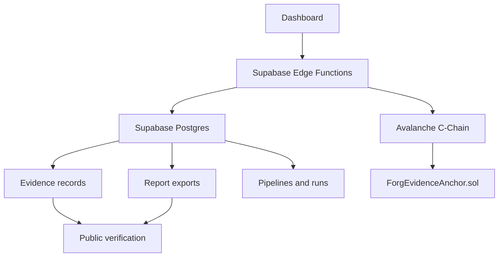

# Technical Architecture

This document explains the repository architecture supporting Avalanche Phase 2 review.

## System Overview



Forg3t is a multi-project evidence control plane. A user creates an unlearning or suppression job, the backend creates a sanitized evidence record, deterministic hashes are computed, optional Avalanche anchoring submits the commitment on-chain, and auditors can verify supported result fields through authenticated or public routes.

## Review Boundaries

- This architecture describes implemented repository components.
- It does not prove that a particular enterprise used the system.
- It does not prove production uptime, unless deployment logs and live environment access are provided separately.
- It does not include a separately published SDK package; the SDK-like surface is `src/lib/api.ts`, curl examples, and `scripts/phase2-smoke.mjs`.
- It supports black-box suppression verification. It does not prove internal model-weight deletion without integration-specific evidence.

## Dashboard

Key frontend routes are defined in `src/App.tsx`:

- `/dashboard`: overview, recent jobs, integrations, and pipeline summary.
- `/dashboard/jobs`: job history and filters.
- `/dashboard/jobs/:jobId`: job detail, evidence commitment, anchor status, exports.
- `/dashboard/evidence/:evidenceId`: evidence manifest, report payload, export controls, anchor metadata.
- `/dashboard/verify`: drag-and-drop evidence verification.
- `/verify/:token`: public verification route.
- `/dashboard/pipelines`: repeatable verification pipeline create/run UI.
- `/dashboard/settings`: project settings, integrations, and role management.

Important UI files:

- `src/pages/Dashboard.tsx`
- `src/pages/Jobs.tsx`
- `src/pages/JobDetail.tsx`
- `src/pages/EvidenceDetail.tsx`
- `src/pages/Verify.tsx`
- `src/pages/Pipelines.tsx`
- `src/pages/Settings.tsx`
- `src/components/JobsTable.tsx`
- `src/components/StatusBadge.tsx`

## Client API Layer

`src/lib/api.ts` is the frontend API abstraction. It calls Supabase Edge Functions under:

```text
${VITE_SUPABASE_URL}/functions/v1/<function-name>
```

Client API groups:

- `jobsApi`
- `anchorsApi`
- `verifyApi`
- `reportsApi`
- `pipelinesApi`
- `integrationsApi`
- `projectAccessApi`

## Supabase Edge Functions

| Function | Purpose | Important routes |
| --- | --- | --- |
| `jobs` | Create/list/get jobs and evidence shells | `POST /functions/v1/jobs`, `GET /functions/v1/jobs?projectId=...`, `GET /functions/v1/jobs?jobId=...` |
| `anchors` | Submit or read Avalanche anchors | `POST /functions/v1/anchors`, `GET /functions/v1/anchors?evidenceId=...`, `GET /functions/v1/anchors?anchorId=...` |
| `verify-evidence` | Verify evidence by id, public token, local hash, or tx status | `GET /functions/v1/verify-evidence?token=...`, `POST /functions/v1/verify-evidence` |
| `reports` | Read and export JSON/CSV/PDF report artifacts | `GET /functions/v1/reports`, `POST /functions/v1/reports` |
| `pipelines` | Create/list/get/run verification pipelines | `GET /functions/v1/pipelines`, `POST /functions/v1/pipelines` |
| `integrations` | Manage OpenAI-compatible and generic HTTP integration configs | `GET /functions/v1/integrations`, `POST /functions/v1/integrations` |
| `project-access` | Manage project memberships and roles | `GET /functions/v1/project-access`, `POST /functions/v1/project-access` |

Shared helpers:

- `supabase/functions/_shared/rbac.ts`
- `supabase/functions/_shared/avalanche.ts`
- `supabase/functions/_shared/crypto.ts`
- `supabase/functions/_shared/cors.ts`
- `supabase/functions/_shared/assistantSuppression.ts`

## Database Tables

Primary tables are created or extended in `supabase/migrations/20260430170000_avalanche_build_games.sql` and `supabase/migrations/20260524153640_fix_project_memberships_rls.sql`.

Important tables:

- `projects`: project/workspace records.
- `project_memberships`: user role assignments for owner, admin, compliance, auditor, developer, viewer.
- `unlearning_requests`: job records for suppression/unlearning requests.
- `evidence_records`: sanitized evidence manifest, report payload, evidence hash, job hash, report hash, verification status.
- `evidence_anchors`: Avalanche transaction metadata and anchor status.
- `report_exports`: JSON/CSV/PDF export metadata and payload.
- `verification_pipelines`: reusable pipeline configuration.
- `pipeline_runs`: run status, created jobs/evidence/anchors/reports.
- `integration_configs`: API provider configuration.
- `integration_secrets`: encrypted secret material, service-role only.

RLS and role behavior are enforced through:

- `public.project_role(project_uuid uuid)`
- `public.has_project_role(project_uuid uuid, allowed_roles text[])`
- RLS policies on project, job, integration, pipeline, evidence, anchor, and report tables.

## Evidence Records

Evidence records are created by job and pipeline flows. The important fields include:

- `evidence_hash`: deterministic commitment to the sanitized bundle.
- `job_hash`: deterministic commitment to job-level evidence.
- `manifest`: sanitized evidence manifest.
- `report_payload`: reportable compliance summary.
- `report_hash`: committed hash for generated PDF reports when available.
- `public_verification_token`: scoped public verification token.
- `verification_status`: current verification state.

Evidence creation is implemented primarily in:

- `supabase/functions/jobs/index.ts`
- `supabase/functions/pipelines/index.ts`
- `shared/workflows.ts`

## Avalanche Anchoring

The smart contract is `contracts/contracts/ForgEvidenceAnchor.sol`.

The runtime anchoring path is:

1. Frontend calls `anchorsApi.create`.
2. `supabase/functions/anchors/index.ts` loads the evidence record.
3. `_shared/avalanche.ts` creates Viem clients from configured network/env.
4. The function submits `submitEvidence(jobHash, evidenceHash)` to the configured contract.
5. The returned tx hash, network, chain id, block number, contract address, and status are written to `evidence_anchors`.
6. Job/evidence pages and public verification display the anchor status and explorer URL.

Required Edge Function env:

- `AVALANCHE_ANCHOR_PRIVATE_KEY`
- `AVALANCHE_ANCHOR_NETWORK`
- `AVALANCHE_FUJI_RPC_URL`
- `AVALANCHE_MAINNET_RPC_URL`
- `AVALANCHE_FUJI_CHAIN_ID`
- `AVALANCHE_MAINNET_CHAIN_ID`
- `AVALANCHE_FUJI_CONTRACT_ADDRESS`
- `AVALANCHE_MAINNET_CONTRACT_ADDRESS`
- `AVALANCHE_CONFIRMATIONS_REQUIRED`

## Verification Flow

Verification is implemented in `supabase/functions/verify-evidence/index.ts` and `src/pages/Verify.tsx`.

Supported paths:

- Authenticated verification by `evidenceId`.
- Public verification by `public_verification_token`.
- Uploaded artifact verification by local hash and artifact type.
- Transaction status refresh when transaction hash and network are provided.

Expected verification states include:

- `valid`
- `mismatch`
- `anchor_not_found`
- `anchor_pending`
- `anchor_confirmed`
- `anchor_failed`
- `invalid_bundle`

## Reporting Exports

Report export behavior is implemented in:

- `supabase/functions/reports/index.ts`
- `src/pages/JobDetail.tsx`
- `src/pages/EvidenceDetail.tsx`
- `src/lib/pdfGenerator.ts`

Supported formats:

- JSON
- CSV
- PDF

Exports are recorded in `report_exports`, and report status/hash fields are written back to `unlearning_requests` and `evidence_records` where applicable.

## Role-Based Access

Roles:

- `owner`
- `admin`
- `compliance`
- `auditor`
- `developer`
- `viewer`

Frontend role helpers are in `src/lib/domainUtils.ts`, with tests in `src/lib/domainUtils.test.ts`.

Backend role checks use:

- `supabase/functions/_shared/rbac.ts`
- `supabase/functions/project-access/index.ts`
- RLS policies in migrations.

High-level behavior:

- Owners/admins manage project settings and memberships.
- Owners/admins/developers can create jobs and manage integrations where allowed.
- Compliance users can review evidence and exports.
- Auditors and viewers have restricted read/verification behavior.

## Pipelines

Pipeline files:

- `src/pages/Pipelines.tsx`
- `supabase/functions/pipelines/index.ts`
- `shared/workflows.ts`
- `shared/workflows.test.ts`

Data flow:

1. User creates a `verification_pipelines` record.
2. User runs the pipeline.
3. A `pipeline_runs` row is created.
4. Scoped pipeline items are expanded into jobs.
5. Evidence records are generated for created jobs.
6. Optional anchor records are created or submitted depending on config.
7. JSON/CSV/PDF export records are created when export is enabled.
8. The run stores created job, evidence, anchor, and report IDs.

## API-Based AI Integrations

Integration files:

- `src/pages/Settings.tsx`
- `supabase/functions/integrations/index.ts`
- `supabase/functions/_shared/assistantSuppression.ts`
- `supabase/functions/_shared/crypto.ts`
- `docs/api/evidenceAnchoring.md`

Supported integration concepts:

- OpenAI-compatible API endpoints.
- Generic HTTP endpoints.
- Bearer/API key style secret storage.
- Encrypted secret storage in Supabase, service-role access only.

The repository documents API lifecycle examples from integration setup to job creation, evidence retrieval, anchoring, verification, and exports. A reviewer should treat real provider credentials and partner endpoint access as external evidence.

## SDK Flow

The repository does not currently ship a separately published SDK package. The SDK-like client surface is the dashboard API abstraction in `src/lib/api.ts`, plus curl examples and `scripts/phase2-smoke.mjs`.

Reviewer flow:

1. Configure Supabase URL and anon key.
2. Acquire user access token.
3. Create a job through `POST /functions/v1/jobs`.
4. Read evidence from the job response.
5. Optionally anchor with `POST /functions/v1/anchors`.
6. Verify with `GET /functions/v1/verify-evidence`.
7. Export with `POST /functions/v1/reports`.

## Boundaries

This architecture supports black-box suppression verification for API-accessible systems. It does not prove internal model-weight deletion unless a specific integration supplies verifiable internal evidence.
